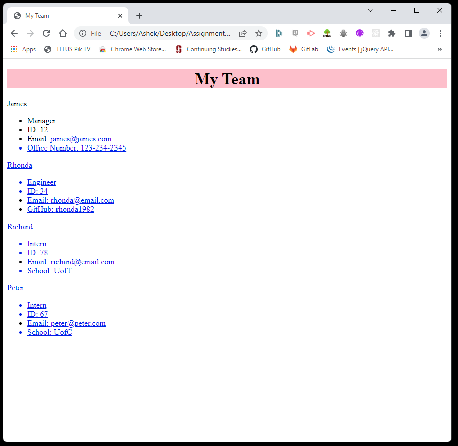

# **Team Profile Generator**

### **Project Description:**
This app build a Node.js command-line application that takes in information about employees on a software engineering team and generates an HTML webpage that displays summaries for each person.

### **Technologies Used & Acceptance Criteria:**
This website uses these technologies to work properly:
- [HTML] - HyperText Markup Language.
- [CSS] - Cascading Style Sheets used for the website styles.
- [JS] - Advanced JavaScript Language.
- Node.js
- Inquirer.js (for question prompts)
- Jest.js (for testing)

This website was coded using the Acceptance Criteria mentioned below:
- WHEN I am prompted for my team members and their information, THEN an HTML file is generated that displays a nicely formatted team roster based on user input

- WHEN I click on an email address in the HTML, THEN my default email program opens and populates the TO field of the email with the address

- WHEN I click on the GitHub username, THEN that GitHub profile opens in a new tab

- WHEN I start the application, THEN I am prompted to enter the team manager’s name, employee ID, email address, and office number

- WHEN I enter the team manager’s name, employee ID, email address, and office number, THEN I am presented with a menu with the option to add an engineer or an intern or to finish building my team

- WHEN I select the engineer option, THEN I am prompted to enter the engineer’s name, ID, email, and GitHub username, and I am taken back to the menu

- WHEN I select the intern option, THEN I am prompted to enter the intern’s name, ID, email, and school, and I am taken back to the menu

- WHEN I decide to finish building my team, THEN I exit the application, and the HTML is generated

### **Credits:**
- [W3Schools](https://www.w3schools.com "W3Schools")
- [MDN Web Docs](https://developer.mozilla.org "MDN Web Docs")
- [Google](https://www.google.com "Google's Homepage")
- [Stack Overflow](https://stackoverflow.com "Stack Overflow website")
